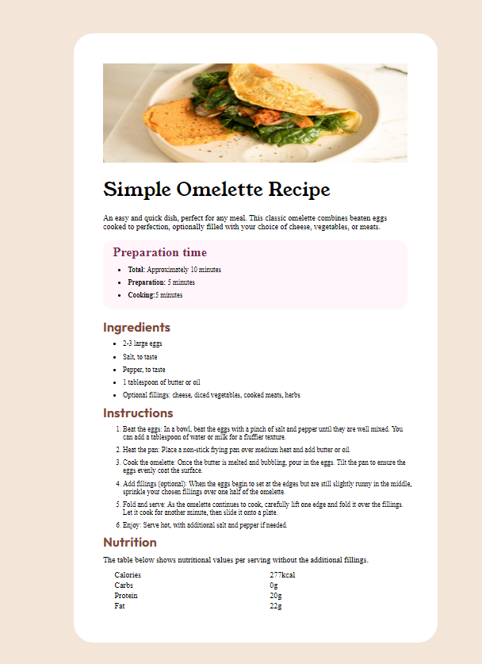

# Frontend Mentor - Recipe page solution

This is a solution to the [Recipe page challenge on Frontend Mentor](https://www.frontendmentor.io/challenges/recipe-page-KiTsR8QQKm). 

## Table of contents

- [Overview](#overview)
  - [The challenge](#the-challenge)
  - [Screenshot](#screenshot)
  - [Links](#links)
- [Author](#author)

## Overview
  Used flexbox to recreate this recipe card. It's a responsive and I tried to build it as close as possible to the given design, still there are some scope of improvements especially related to some fonts, colors and underlines. That I'll fix later. 

### Screenshot

### Links

- Solution URL: [Github Repository Link](https://github.com/Prabhashg/frontendmentor_recipe-page)
- Live Site URL: [Click Here to View](https://frontendmentor-recipe-page.vercel.app/)

## Author

- Website - [Prabhash Kumar](https://www.linkedin.com/in/prabhash-kumar-405648201/)
- Frontend Mentor - [@Prabhashg](https://www.frontendmentor.io/profile/Prabhashg)
- Twitter - [@Krprabhasw](https://www.twitter.com/krprabhasw)

